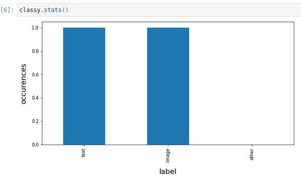

<div style='display: flex; align-items:center;'>
    
    <span style='height: 75px; padding:0; margin: -6px; font-weight: bold;'>
        <div style='font-size: 30px; line-height: 55px; padding: 0; margin: 0;'>
            Classy Pandas
        </div>
        <div style='font-size: 20px; line-height: 20px; padding: 0; margin: 0;'>
            Quickly annotate/label your data using jupyter widgets and pandas.
        </div>
    </span>
</div><br>
   
Sometimes you have a dataset that you need to label before training your classification models or whatever. If you are already using jupyter and pandas why not do that using some ipywidgets?

### Prerequisites

What things you need to install the software and how to install them

```
pip install pandas
pip install jupyter
pip install ipywidgets
```

If you are using jupyter lab you will also need to install ipywidgets extension:
https://ipywidgets.readthedocs.io/en/latest/user_install.html

### Installing

Once you have the above installed simply run:

```
pip install classypandas
```

### Examples

You can then run the examples in the demo folder in this repository to start labelling! Since the content is displayed as html you can define your column as an html string and have it presented in the screen anyway you want it.

Code:
```
import pandas as pd
from classypandas import core

df = pd.read_csv('demo.csv')
labels = ['text', 'image', 'other']
classy = core.Classy(df, 'html', 'label', labels)
classy.display()
```

Preview:


You can then, at any time check your progress:




## License

This project is licensed under the MIT License - see the [LICENSE.md](LICENSE.md) file for details

